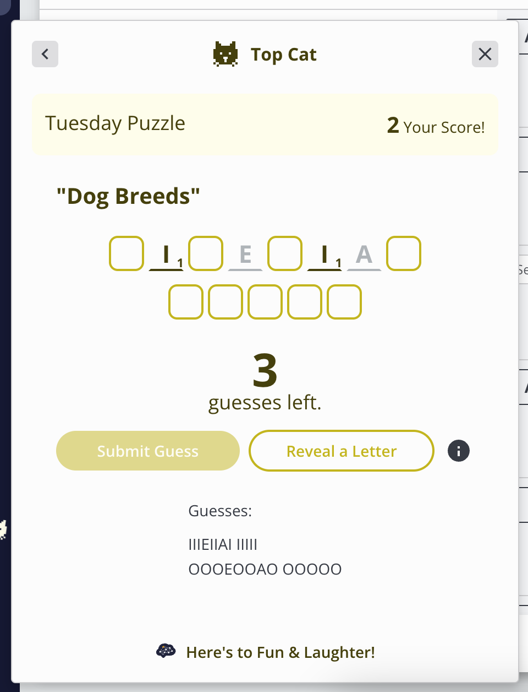
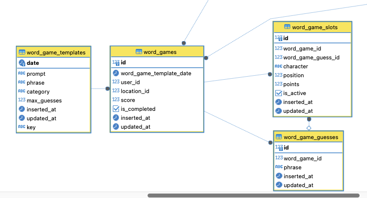
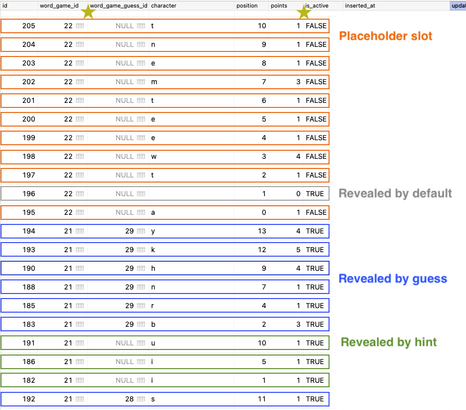

# Instinct Word Game Pairing Exercise

The goal of the Instinct Word Game exercise is to pair together to give both of us an example of working together on a real problem. This is not a test. Rather, it is an exercise that will be scored on collaboration, problem solving, and competence to parse and make suggestions in a codebase.

## Expectations

- Elixir experience not required.
- We will not complete the coding for this exercise in 40 minutes... not the goal.
- Designed to be fun! No one works well when anxious.
- Demonstrate skill and experience on collaboration and discussion.
- Demonstrate expertise in discussing design ideas and tradeoffs.
- Displaying competence parsing code for understanding, following the logic.
- Ability to turn an idea into code.

## Structure

1. Interviewer will demo the Instinct Word Game in the app.
   
2. Interviewer will explain the data structure for the Instinct Word Game.
   
   
3. Interviewer will propose the prompt:
   - **Currently we create a PLACEHOLDER entry in the `word_game_slots` table for every character in the phrase when the game is CREATED.**
     - This was primarily done for the UI presentation of the slots.
   - **We have determined that only 50% of users fill out all the slots in a game, so these records create a lot of waste.**
   - **We would like to simplify the data structure that represents our game and eliminate the number of rows we must store for every game. What is a simpler data model we could work towards in this exercise?**
   - We can briefly discuss the impact of this change on the UI presentation, but it is not the primary goal of this exercise.
4. Candidate will discuss the prompt with the interviewer to design a solution. The interviewer may act as the product manager or fellow developer.
5. Candidate with begin implementing the solution in the [`lib/word_games.ex`](./lib/word_games/word_games.ex) file.
