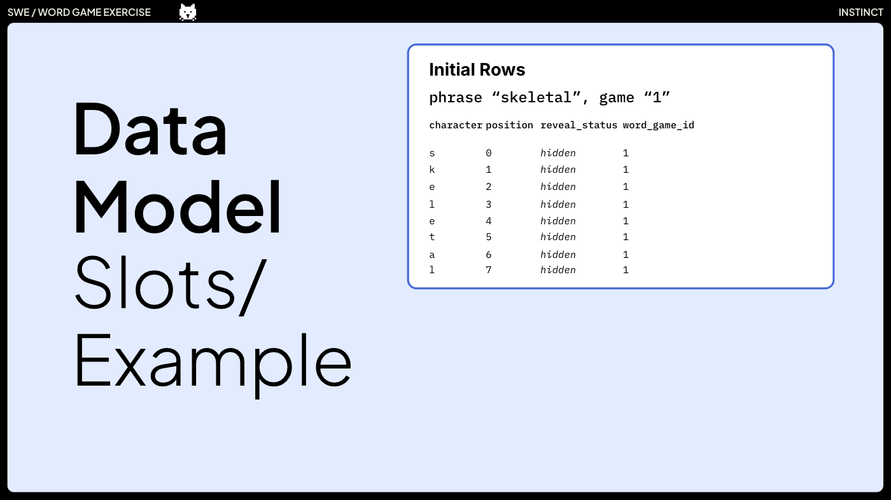

# SWE Interview Exercise: Word Game

## Introduction

Welcome to the Instinct Interview Exercise!

The goal of this exercise is to pair together to give both of us an example of working together on a real problem. This is not a test. Rather, it is an exercise that will be scored on collaboration, problem solving, and competence to implement an idea in a codebase.

To get started, let’s review the feature we will work on:

## Demo

[Paws 'n' Plaw Demo](https://www.loom.com/share/e8be7ab56e184fe199d4719cfd21b477?sid=76f2e104-470c-41c1-94f7-3eaff472f6be)

## How It's Made

Stack:
- Elixir GraphQL API
- Postgres DB
- React UI

Data Model:
- Relational structure
- Single-tenant

## Mission

We suggest simplifying to only two tables:
- Keep the standard data templates table.
- Keep the games table.
- Eliminate the slots and guesses tables.
  - Our idea was to move this information into a jsonb `state` column on the games table.

That’s what we’ll work on in the exercise! Here are the topics we’d like you to cover:
- What design do you think we should implement?
- How would you break down this project into incremental pieces?
- Let’s look at the code together and begin mocking up some of the initial changes.

## Expectations
- This is not a test with a single solution. Rather, it is an exercise that will be scored on collaboration, problem solving, and competence to implement an idea in a codebase.
- We would like to see you interact with the codebase in your editor and tools, but we do not need to see you code!

---

For Interviewer: [**SWE Interview Exercise Presentation**](https://docs.google.com/presentation/d/1IcJBuyRc_tGDn6-LJmtNP0DdDSiW7I_uTn5ClYN7JCM/edit?usp=sharing)